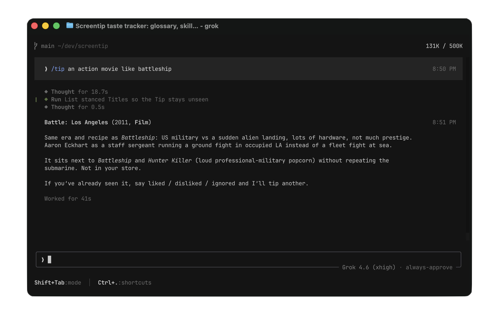

# Screentip

Tell an agent what you like. Ask what to watch next.

No app, no account, no database. Open this folder in a coding agent and type a command. Your list stays on your computer and is never committed.

## Usage

Type `/tip` when you want something to watch. Say a genre, a mood, or “like this other film” if you have a direction:



The other commands:

```
/like Battleship
/like the gerard butler submarine movie
/dislike Cats
/ignore Twilight
```

| You type | What happens |
|---|---|
| `/like …` | You watched it and liked it. A name or a description is fine. |
| `/dislike …` | You watched it and didn't. |
| `/ignore …` | You don't want it suggested. You haven't judged it. |
| `/tip …` | One thing to watch that isn't already on your list. |

If two films share a name, you get a short list and pick. If a tip is something you've already seen, say liked / disliked / ignored — it records that and tips another.

## Setup

```bash
git clone git@github.com:sgruetter/screentip.git
cd screentip
```

Open the folder in your coding agent. Start with `/like` on a few things you actually watched, then `/tip`.

## Privacy

Your list is `data/taste.txt` on this machine. Git ignores it. The repo is the how-to; the list is yours.

## License

[MIT](LICENSE).
